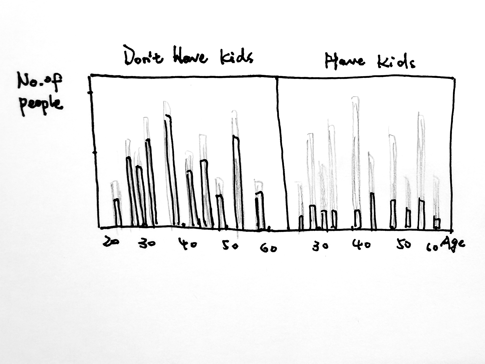
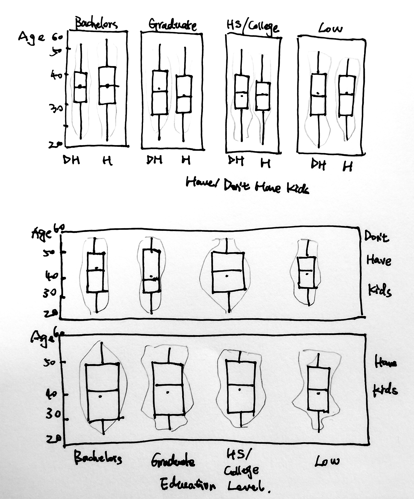
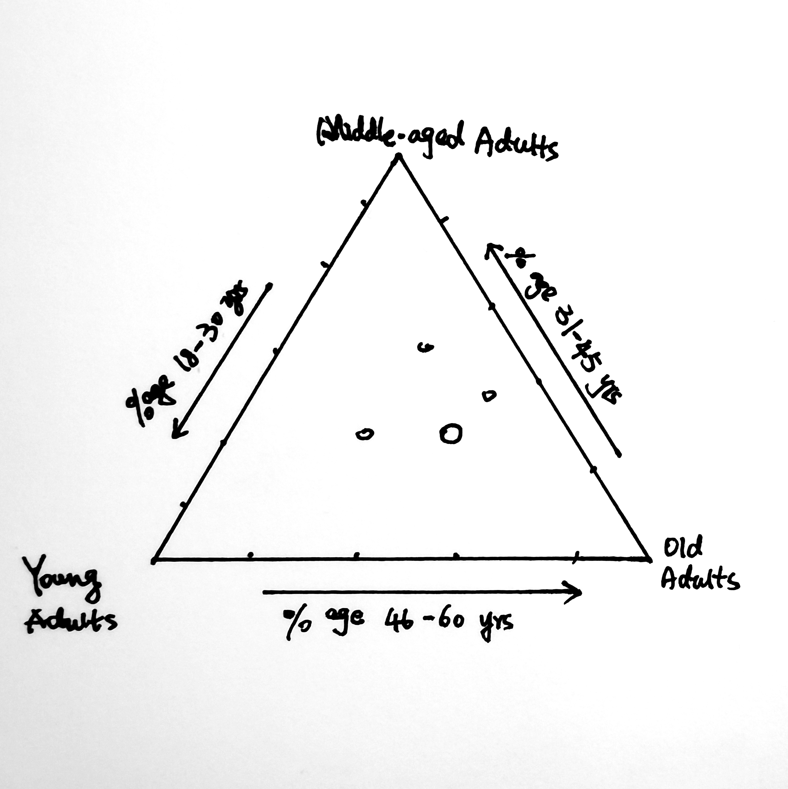
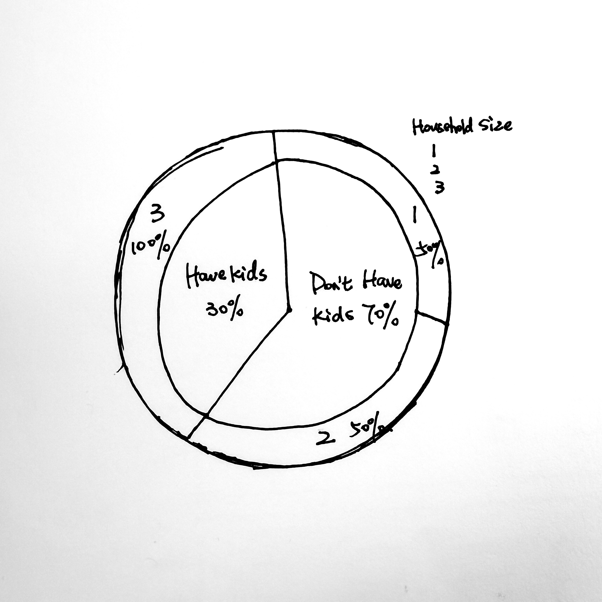

```{r setup, include=FALSE}
knitr::opts_chunk$set(echo = TRUE)
```

## Overview

[In Take-home Exercise 1](https://isss608-ay2021-22april.netlify.app/th_ex/th_ex01), demographic analysis is required to reveal the demographic of the *city of Engagement, Ohio USA* by using `tidyverse` packages. 

Dataset of Participants can be downloaded through the link:
[participant.csv](https://vast-challenge.github.io/2022/)

In this article, with `ggplot2`, histogram and boxplots combined with violin plots. 
Besides, additional packages: `webr` and `ggtern` are used to create more complicated plots: pie chart combined with donut plot and ternary plot respectively.

## Installing Packages and Importing Data

Before we start to explore and visualize the data, required packages should be installed and the dataset should be imported.

### Installing Packages

*tidyverse* is required to visualize the data. Besides, *webr* is also used in this task to create pie chart with donut chart and *ggtern* is used to create ternary chart. The code below installs and loads required packages.

```{r}
packages = c('tidyverse','webr', 'ggtern')
for(p in packages){
  if(!require(p, character.only = T)){
    install.packages(p)
  }
  library(p, character.only = T)
}
```
### Importing Data

The code chunk below imports `Participants.csv` from the data folder into R and save it as a data frame called participants.

```{r}
participants <- read_csv("data/Participants.csv")
```

## Histogram

### The Proposed Design

Histograms can visualize the distribution of variables by categories.
In this task, the distribution of age can be visualized between "have kids" and "don't have kids" groups with context of all participants. The sketch is shown below:

```{r echo=FALSE}

```

### The Original Design
Before we plot our graph, we should change the type and name of variable 'haveKids' with the code below:

```{r}
p<- participants
p$haveKids <- as.character(p$haveKids)

p['haveKids'][p['haveKids'] == 'TRUE'] <- "Have kids"
p['haveKids'][p['haveKids'] == 'FALSE'] <- "Dont Have kids"
```

With code below, we created histograms of the distribution of age between "have kids" and "don't have kids" groups. 

```{r}
ggplot(p, aes(x = age))+
  geom_histogram()+
  facet_wrap(~ haveKids)

```

However, it is not informative since it cannot show us the proportion of different groups with context of all participants as a whole.

### The Makeover Design

With code below, we added a 'background', revealing the distribution of age between two groups (with/without kids) with reference to all participants. Besides, title, xlab, ylab are also manipulated to make the graph more informative.

```{r}
p_bg <- p[, -3]

ggplot(p, aes(x = age, fill = haveKids)) + 
  ggtitle("Distribution of Age in People Who Have/Don't Have Kids
          \n(With Background of the Whole Group)") +
  geom_histogram(data = p_bg, fill = "grey", alpha = 0.5) +
  geom_histogram(colour = "black") +
  facet_wrap(~ haveKids) +
  guides(fill = "none") +
  xlab("Age") +
  ylab("No. of \nPeople") +
  theme_bw()
```

### Insights from this Visualization

In this makeover histogram, we can see the distribution of age doesn't have a specific trend in both 'have kids' and 'don't have kids' group. The uneven distribution of age in the whole group is mainly attributed by the uneven distribution of age in 'don't have kids' group (see age=30-32 and 42-44).

## Box Plot

### The Proposed Design

With boxplot, we can see the distribution (as well as mean value) of age with different categories. For example, we can have the comparison between 'have kids' and 'don't have kids' participants in different education levels as well as the comparison between participants with different education levels in 'have kids' and 'don't have kids' groups.

The sketch of proposed design is shown below:

```{r echo=FALSE}

```


### The Original Design

With the code below, we can create different groups of boxplot showing the distribution of age and compare the mean in different levels. However, the distribution of age cannot be showed very clearly with only boxplot. The mean values are not very easy to be compared. Besides, xlabs are also overlapped.

```{r}
ggplot(data=p,
       aes(y = age, x= haveKids)) +
  facet_grid(~ educationLevel) +
  geom_boxplot() 
```
```{r}
ggplot(data=p,
       aes(y = age, x= educationLevel)) +
  facet_grid(haveKids ~.) +
  geom_boxplot()
```

### The Makeover Design

With the code below, violin plot is added, showing a very detailed distribution trend of age in each group. Besides, title, xlab and ylab are improved. The point to show mean value and the notch are also added.

```{r}
ggplot(data=p,
       aes(y = age, x= haveKids)) +
  ggtitle("Distribution of Age in Different Education Level 
          \n(Subgrouped by having kids or not) ") +
  facet_grid(~ educationLevel) +
  geom_violin(fill="light blue") +
  geom_boxplot(notch=TRUE, alpha=0.5) +
  xlab("Have/Don't Have Kids") +
  ylab("Age") +
  theme(axis.title.y=element_text(angle = 0))+
  theme(axis.text.x=element_text(angle = 10))+
  stat_summary(geom = "point",
               fun="mean",
               colour ="red",
               size=2)
```
```{r,fig.width=5, fig.height=5}
ggplot(data=p,
       aes(y = age, x= educationLevel)) +
  ggtitle("Distribution of Age of People Who Have Kids/Don't Have Kids  
          \n(Subgrouped by Education Level) ") +
  facet_grid(haveKids ~.) +
  geom_violin(fill="light blue") +
  geom_boxplot(notch=TRUE, alpha=0.5) +
  xlab("Education Level") +
  ylab("Age") +
  theme(axis.title.y=element_text(angle = 0))+
  stat_summary(geom = "point",
               fun="mean",
               colour ="red",
               size=2)
```

### Insights from this Visualization
In the first Plot, we can see that except for bachelors group, mean age of participants who have kids is smaller than those who don't have kids, and it is most obvious in low education level group.

In the second Plot, we can see that in the group of 'Don't have kids', participants with bachelor degree have the smallest value of age, while in the group of 'Have kids', participants with low education level have the smallest value of age.

Besides, violin plot clearly represents the distribution of age in each education level group 


## Ternary Plot

### The Proposed Design

Ternary plot can help use to see the ratios of the three variables as positions in an equilateral triangle. In this task, it can graphically depict the proportions of different age groups of different education level differenciated using points with different color and size.

```{r echo=FALSE}

```

### Data Wrangling

#### Group age values into three age groups:Young Adults, Middle-aged Adults and Old Adults.
1. Young Adults: 18-30 years old

2. Middle-aged Adults: 31-45 years old

3. Old Adults: 46-60 years old

```{r}
age_group<-p [-6:-7]
age_group$Age_Group<-cut(age_group$age,
                         breaks = c(18,31,46,61),
                         labels = c("YoungAdults","MiddleAgedAdults", "OldAdults"))
head(age_group)
```

#### Group participants by Education Level and Age Groups with the population of each group.
```{r}
age_group_el <- age_group %>% 
  select(c("participantId","educationLevel","Age_Group")) %>%
  group_by(educationLevel, Age_Group) %>% 
  summarise(population=n())
head(age_group_el)
```

#### Trasfering the values of age group into column names, with the values of population in each education level.

```{r}
age_group_el_new <- age_group_el %>%
  mutate(i = row_number()) %>%
  spread(Age_Group, population) %>%
  select(-i)
age_group_el_new <- age_group_el_new[1:4]
age_group_el_new
```

#### Summarzing the values of different education level.
```{r}
age_group_el_new[is.na(age_group_el_new)] <- 0
age_group_el_final <-age_group_el_new %>%
  group_by(educationLevel) %>% 
  summarise(YoungAdults=sum(YoungAdults),MiddleAgedAdults=sum(MiddleAgedAdults),
            OldAdults=sum(OldAdults)) %>% 
  mutate(Population= YoungAdults + MiddleAgedAdults + OldAdults)
head(age_group_el_final)
```

### The Original Design

With the following code, ternary plot could be built.

However, as we can see, there are lots of flaws to be improved:

1. The points are overlapped: can be solved by changing the alpha value and xlim/ ylim.

2. The legend should be moved to the bottom.

3. The angle of title of each axis should be adjusted.

4. The title of the ternary should be added.

5. The arrow in each axis should be added to make the plot easier to read.

```{r}
ggtern(age_group_el_final, aes(x=YoungAdults,y=MiddleAgedAdults, z=OldAdults, 
                               fill= educationLevel, size=Population)) +
  geom_point(shape=21) +
  guides(size = FALSE) +
  theme_bw() 

```

### The Makeover Design

With the following code, flaws of the original design are solved.

```{r}
ggtern(age_group_el_final, aes(x=YoungAdults,y=MiddleAgedAdults, z=OldAdults, 
                               fill= educationLevel, size=Population)) +
  geom_point(alpha=0.7,shape=21, color="white") +
  guides(size = FALSE) +
  theme_bw() + 
  ggtitle("Age Composition in Different Educational Level")+
  scale_T_continuous(limits=c(0.25,0.5)) + 
  scale_L_continuous(limits=c(0.25,0.5)) +
  scale_R_continuous(limits=c(0.25,0.5))+
  theme_showarrows() +
  labs( x = "Young Adults",
        xarrow = "% age 18-30 years",
        y = "Middle-aged Adults",
        yarrow= "% age 31-45 years",
        z  = "Old Adults",
        zarrow = "% age 46-60 years") + 
  theme(legend.position = "bottom",
        legend.box = "horizontal",
        tern.axis.title.T = element_text(),
        tern.axis.title.L = element_text(hjust = 0.2, vjust = 0.7, angle = -60),
        tern.axis.title.R = element_text(hjust = 0.8, vjust = 0.6, angle = 60))
```

### Insights from this Visualization

From the makeover plot, we can see the position and size of each education level. High School/ College has the biggest size, followed by Bachelors and Graduate groups, and the size of Low group is much smaller than all the other groups.

Besides, we can see the proportion of participants of different age groups in every education level groups. For example, in Bachelors group, the age composition is roughly 'Young: Middle-aged: Old = 36:32:33', which is very even. However, in Low group, it is 'Young: Middle-aged: Old = 27: 40: 33'.

## Pie Chart

### The Proposed Design

Pie chart can indicate proportion of values in different groups. In this exercise, we can explore the proportion of participants who have kids and don't have kids with different household size.

The sketch is shown below:

```{r echo=FALSE}

```

### The Original Design

First, we should change the id of participants into numeric data type and group participants by household size and have/don't have kids with the count in each subgroups.

```{r}
p$participantId <- as.numeric(p$participantId)
p$householdSize <- as.character(p$householdSize)
p_new <- p %>% group_by(householdSize, haveKids) %>% count(haveKids)
print(p_new)
```

With the code below (using ggplot2), we can only get individual pie charts and donut plots and those graphs cannot give us a combination of proportion of each group.

```{r}
ggplot(data=p_new, aes(x=" ", y=n, group=householdSize, 
                       colour=householdSize, fill=householdSize)) +
  geom_bar(width = 1, stat = "identity") +
  coord_polar("y", start=0) + 
  facet_grid(.~ haveKids) +theme_void()
```

### The Makeover Design

To solve the problem of original design, webr package should be used to build a combination of pie chart and donut plot.

With following code, we can draw a pie chart surrounded with a donut plot to show the relation and proportion of each group.

```{r}
PieDonut(p_new, aes(haveKids, householdSize, count=n),
         explode=2,
         explodePos = 0.2,
         pieLabelSize = 3.5,
         donutLabelSize = 3.5,
         titlesize = 4,
         title = "Proportion of People Who Have/Don't Have Kids 
          in Different Household Size")
```
### Insights from this Visualization

The makeover plot gives us a clearer overview of the number of participants in each group. Interestingly, there are only three types of household with the size of 1, 2 and 3, and all households with the size of three have kids and all households with the size of one and two don't have kids and the the number of participants in these three groups are very even (nearly 3:3:3).
